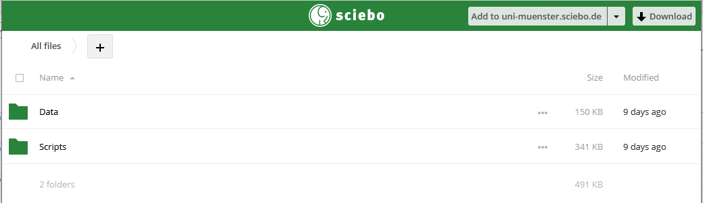

# What we need to do

Based on the email we received 2022-05-02, 19:45 CEST, we need to perform these steps:

::: {.infobox}

To complete your contribution to the analysis phase, we will kindly ask you to perform the following four steps:

- Upload your pre-processed data and analysis code to the submission portal (as a team, see instructions below)
- Report your results for each hypothesis as a free-text paragraph (as a team; instructions and link will follow in a separate email next week)
- Report your pre-processing and analysis pipeline via our structured analysis questionnaire (as a team; instructions and link will follow in a separate email next week)
- Report your results and confidence ratings via a short structured results questionnaire (each team member individually; instructions and link will follow in a separate email next week)

:::

# Step 1: pre-processed data and analysis code

We need to: "Upload your pre-processed data and analysis code to the submission portal (as a team, see instructions below)". 

::: {.infobox}

Data uploading

As a first step, please upload the time-domain data after pre-processing and the scripts you used for pre-processing and analysis to our submission portal (each team receives its own upload link). Please keep your data structured as it is explained in the instructions provided in the folder in the link below as well as in our FAQ section (https://www.eegmanypipelines.org/faq.php). In case you applied different preprocessing pipelines to different hypotheses, please upload time-domain data that corresponds to hypothesis 4.b (before TF decomposition).

Your team’s individual link to upload data: 
https://uni-muenster.sciebo.de/s/6csuS6Sta2VQJfB/authenticate

The password is your team identifier.

The submission portal is open until the 15th of May.

Importantly, if you experience any technical difficulties while uploading your data - do not worry, we are here to help you. Simply, contact us by email at committee@eegmanypipelines.org and we will find a solution.

:::

After logging in to the platform, we see: . Each of the folders contains a pdf file with instructions. I've added these two files to the report folder of this repo.

## Upload pre-processed data

`\Data\` needs to contain one folder per participant (`Subj01`...). Each participant folder contains 4 folders:

- `Pre-processed time series data`

- `Removed ICA components (txt files)`

- `Excluded trials (txt files)`

- `Excluded sensors (txt files)`

### Question

Should there be two folders, one for ERP and one for TFR? for `Pre-processed time series data`

For removed ICA components:

- two folders?

- which files?

